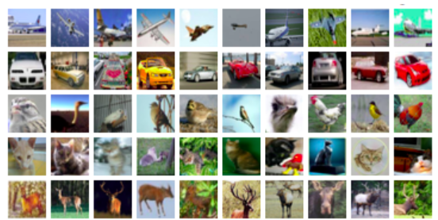
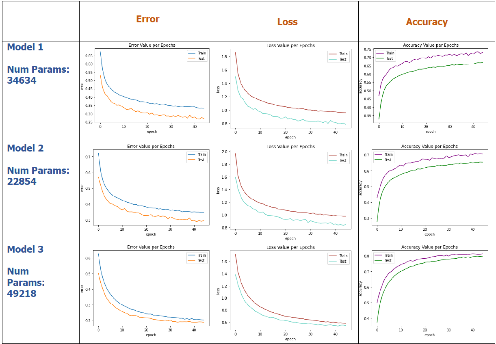

# CIFAR10 CNN

Implement a CIFAR10 classifier with a custom CNN, adhering to strict constraints: achieve over 80% accuracy on the test set and maintain a model with less than 50,000 trainable parameters. The task involves exploring various model architectures (depths, filter sizes, pooling layers) and adjusting hyperparameters (learning rate, batch size) to optimize performance. The project focuses on training convolutional neural networks and encourages experimentation with different configurations to understand their impact on model accuracy and parameter count. This exercise aims to provide hands-on experience in designing and training efficient image classification networks for the CIFAR10 dataset.
## Implementation

#### Background: 
Convolutional Neural Networks (CNNs) are adept at image-related tasks, leveraging convolutional, pooling, and fully connected layers to learn hierarchical features and patterns for accurate image classification.

#### The models:
Implemented three CNN models with 45 epochs each:

Model1: 2 convolutional layers, batch size 400, Adam optimizer, CE loss, utilizing max pool. Fell short of >80% accuracy.

Model2: 3 convolutional layers, batch size 400, Adam optimizer, NLLLOSS, avg pool in layers 2,3, and max pool in layer 3. Achieved 74% accuracy.

Model3: 4 convolutional layers, batch size 400, Adam optimizer, CE loss, incorporated gradient clipping for stability and faster convergence. Used avg pool in layers 2,3, and max pool in layer 4 to control parameters and prevent overfitting. Balancing between avg and max pooling accommodated diverse dataset backgrounds, with avg pool working well for images with bright backgrounds and max pool for those with dark backgrounds.

### The Dataset
CIFAR-10 is a widely used dataset for image classification tasks in machine learning. It consists of 60,000 32x32 color images in 10 classes, with 6,000 images per class. The classes include common objects such as airplanes, automobiles, birds, cats, deer, dogs, frogs, horses, ships, and trucks. CIFAR-10 is commonly employed for benchmarking and developing image classification models due to its moderate size and diversity, making it suitable for training and evaluating convolutional neural networks (CNNs) and other image-based machine learning algorithms.

### Loss Functions

#### Softmax Cross Entropy

The softmax cross-entropy loss function is commonly employed to measure the dissimilarity between the true labels $\(y\)$ and the predicted probabilities $\(\hat{y}\)$ in a classification task. Unlike regular cross-entropy, softmax cross-entropy includes a softmax activation function, which is applied to the model's raw output to obtain probability distributions over the classes. The softmax function ensures that the predicted probabilities sum to 1, making them interpretable as class probabilities.

In PyTorch's `torch.nn` library, the cross-entropy loss is often implemented with softmax. Specifically, the `torch.nn.CrossEntropyLoss` automatically incorporates the softmax function into its computation. This means that when using this loss function, there is no need to explicitly apply a softmax activation to the model's output before calculating the loss.

For each sample in a batch, softmax cross-entropy sums the negative logarithm of the predicted probability assigned to the correct class. The overall loss is then computed as the average across all samples in the batch. This formulation effectively penalizes the model more when its predictions deviate from the true labels, thereby encouraging accurate classification.

The softmax cross-entropy loss formula is given by:

$L(y, \hat {y}) = { -\frac{1}{N} \sum\limits_{i=1}^{N} \sum\limits_{j=1}^{C} y_{i,j} \log(\frac{ e^ {\hat{y_{i,j}}}} {\sum\limits_{k=1}^{C} e^{\hat{y_{i,k}}} }) }$

Where,

- $N {\text{ :The number of elements in the input or the batch size}}$
- $C {\text{ :The number of classes}}$
- $y_{i,j} {\text{ :The true output for the i-th sample and j-th class}}$
- $\hat{y_{i,j}} {\text{ :The predicted output for the i-th sample and j-th class}}$

#### NLLLOSS

The NLLLoss measures the negative log likelihood of the predicted probabilities for the correct classes and is commonly used in classification tasks where the goal is to minimize this loss during training.

$L(y, \hat {y}) = {-\sum\limits_{i=1}^{N}  y_i \log(\hat {y_i}) }$

Where,

- $N {\text{ :The number of elements in the input or the batch size}}$
- $y_{i} {\text{ :The true output for the i-th sample }}$
- $\hat{y_{i}} {\text{ :The predicted output for the i-th sample}}$

### Optimization Step

ADAM (Adaptive Moment Estimation) is a popular optimization algorithm for training deep neural networks. It combines momentum and RMSprop, adapting learning rates for each parameter. Efficient and effective, it mitigates issues like vanishing/exploding gradients, contributing to improved training in deep learning tasks.

$\theta_{t+1} = \theta_t - \frac{\alpha}{\sqrt{\hat{v}_t} + \epsilon} \cdot \hat{m}_t $

Where,

- $\theta_t{\text{: Parameters at time step \ t \}}$
- $\alpha{\text{: Learning Rate}}$
- $\hat{m}_t{\text{: Biased first moment estimate}}$
- $\hat{v}_t{\text{: Biased second raw moment estimat}}$
- $\epsilon{\text{: Small constant to prevent division by zero}}$

## Results

Model 3 outperforms others with an accuracy of 80.096%, test error of 0.1, and train error of 0.199. This model, incorporating various techniques, proves to be the most effective. Interestingly, Models 1 and 2 achieved comparable results despite using different loss functions and having different parameter counts. Notably, Model 2 exhibited faster convergence.
